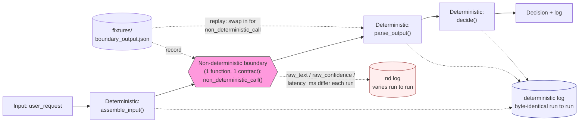

# Determinism at the Non-Deterministic Boundary

Isolate an inherently non-deterministic call (an LLM, a sampled output, a
variable-latency API) behind one function with a fixed input/output
contract. Keep everything on either side of it — assembling the input,
parsing the output, deciding what to do — as pure code with no hidden
randomness of its own.

## What "deterministic around the boundary" means

Not that the final decision is always the same — the boundary's semantic
content can legitimately differ between runs, and a correct decision layer
differs right along with it. What must stay fixed is the process: given the
same boundary output, the surrounding code always does the same thing.
Proven directly: the deterministic log (input assembly, parsed label,
decision) came back byte-identical across repeated runs, while the
boundary's own output (wording, confidence, latency) varied every time.

## Leaks don't just add noise, they flip decisions

Non-determinism sneaks past the boundary in code that looks deterministic
at a glance: a parser keyed on incidental phrasing rather than semantic
content, a wall-clock timestamp inside what looks like pure decision logic,
hash-order iteration that only reshuffles across separate process restarts.
Strongest evidence: a naive parser keyed on phrasing flipped a real
access-control decision (grant vs. deny) for the identical input and
identical underlying verdict, purely because the model's wording happened
to start with a different word. Nothing crashed or errored — the system
silently did the wrong thing while its logs still looked healthy.

## Record/replay comes almost free

Once the boundary is a real function argument rather than a hardcoded call,
capturing its output once to a fixture and replaying it back through the
pipeline makes the entire log — including the previously varying half —
byte-identical across runs.

## What this doesn't prove

This is a structural claim, not variance reduction — reducing how much the
boundary itself varies (temperature, seeding) is a separate, complementary
technique. The proof also stayed offline by design: it did not exercise
real sampling variance over a live network call, and "same label survives
different phrasing" was a property of a deliberately built stub, not a
measured property of any real model.

Evidence: `experiments/agent-infra/determinism/` (`RUN.md`, `NOTES.md`, `diagram.mmd` / `diagram.png`).
