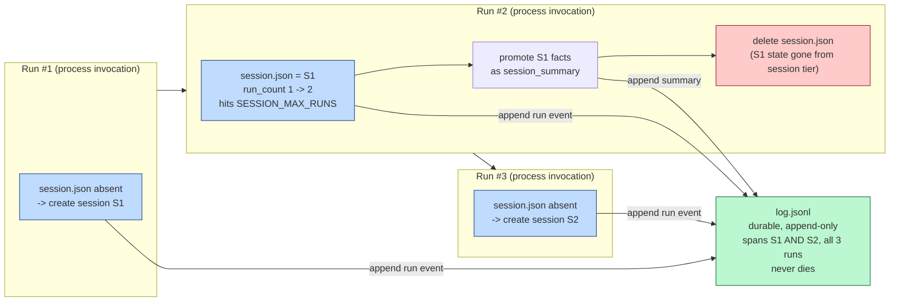

# Memory (Cross-Run Tiering)

`state.md` is scoped to one run; this file is one level up — a session
(several invocations sharing state) — with a durable tier beneath that
spans every session that ever existed. Working state dies at the end of a
run; session state survives across runs but still has a bounded lifetime.

## Same pattern, one level up

An ephemeral session file is overwritten across runs; a durable
append-only log accumulates every session's activity forever. Both are
plain files — the difference is policy, not mechanism: session state is
deleted outright once it expires, the log is never deleted, only appended
to.

## Promotion order is the load-bearing part

When a session expires, its facts must be appended to the durable log —
and that write confirmed — *before* the session file is deleted. Reverse
the order, or fail to sequence it, and a crash between the two operations
reproduces `state.md`'s crash-and-wipe loss one layer up. Expiry alone
isn't what makes this safe; promotion-before-deletion is.

## A deliberate limit: expiry means "start over," not "continue"

Once a session expires, the next run starts a brand-new session with no
facts carried forward, even though the predecessor's summary is sitting in
the durable log. Continuity would require deliberately reading that
summary back on bootstrap; this proof did not build it.

## What this doesn't prove

Concurrent runs racing on the same session file, and reading facts back out
of a past summary to seed a new session, are both untested.

Evidence: `experiments/agent-infra/memory/` (`RUN.md`, `NOTES.md`, `diagram.mmd` / `diagram.png`).
