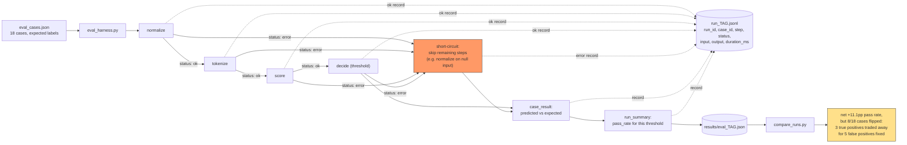

# Observability: Tracing Underneath the Number

An eval reduces a run to one number — useful for "did it get better," but
it can't say why. Observability is the structured, per-step, per-case
trace underneath that number; without it a regression can be noticed but
not debugged. This file owns the tracing/instrumentation half; eval
methodology itself lives in `concepts/eval.md`.

## The same score can hide two different systems

A structured harness (one JSONL record per pipeline step, per case) and a
naive version wrapped in one bare `try/except: print("case failed")`
scored the identical 12/18 on the identical 18 cases. Only the structured
log could tell a crash apart from a wrong answer: a `status` field (`ok` /
`error`) plus `step` and `step_seq` let one `grep` show a failing case
broke in `normalize`, at step 1 of 5, before `tokenize`, `score`, or
`decide` ever ran. The naive version could only ever say "case failed." A
bare pass-rate is not observability — it's the summary observability makes
possible.

## A headline number can hide a trade-off

Raising a classification threshold moved the pass rate from 66.7% to
77.8% — a real, reproducible +11.1 points. Reported alone, that reads as a
clean win. It wasn't: 8 of 18 cases flipped outcome, and the gain was 5
false positives fixed at the cost of 3 true positives newly broken. The net
number and the per-case diff answer different questions — "did this help"
and "what did it cost" — and only the second shows the trade-off actually
being made.

## What the record needs to carry

`run_id` and `case_id` to correlate every record to one invocation and one
case, `step`/`step_seq` to localize where in a pipeline something happened,
`status` (never merged into a single pass/fail) to separate a wrong answer
from a crash, and `duration_ms` to rule out a hang. Only the fields the
eval actually scores on need to be deterministic — a fresh `run_id` every
run is fine.

## What this doesn't prove

The system under test had zero randomness in its decision logic, so
reproducible pass rates came for free across reruns. An LLM-in-the-loop
system wouldn't get that for free — it would need explicit seeding or
replay at the non-deterministic boundary (`concepts/agent-infra/determinism.md`).

Evidence: `experiments/agent-infra/observability/` (`RUN.md`, `NOTES.md`,
`diagram.mmd` / `diagram.png`). The eval-harness half feeds
`playbooks/build-eval-set.md`.
