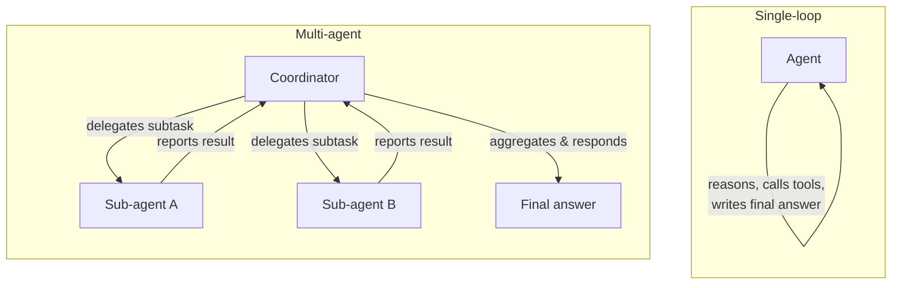

# Orchestration
Orchestration is the architecture that governs how an agent's work gets done: a single loop handling everything itself, or a coordinator delegating pieces of the task to specialized sub-agents. The choice shapes how well a system scales to complex, multi-part tasks and how failures in one part are isolated from the rest. Multi-agent orchestration can parallelize work and keep individual contexts focused, but it introduces its own overhead—coordination, hand-offs, and aggregation—that a single-loop agent never has to deal with.

