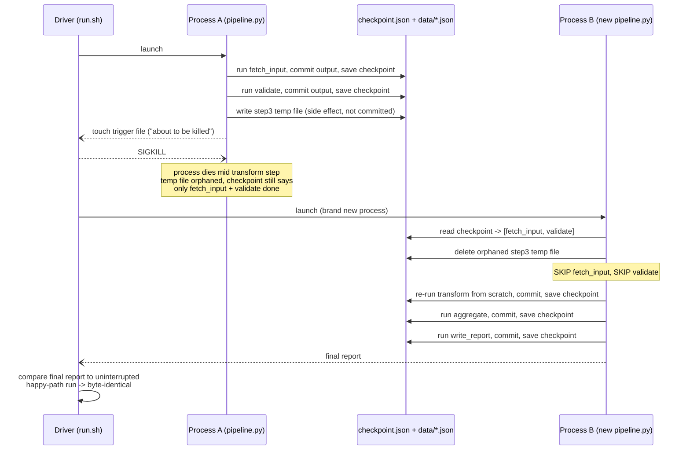

# Recovery: Checkpoint and Resume Across a Restart

A multi-step process that must restart from scratch after any mid-way
crash is broken by design, regardless of how well it performs on the happy
path. Proof: a real `SIGKILL` landing mid-step in a 5-step pipeline,
followed by a brand-new process — no shared memory with the one killed —
resuming and finishing it.

## A checkpoint must never lie

A step's checkpoint isn't written until its output is committed atomically
(temp file, fsync, rename into place). That ordering guarantees the
checkpoint and the artifact it describes can never disagree. A `SIGKILL`
mid-step lands on the temp file, never the committed path — so the crash
leaves an orphaned temp file and nothing else, and the step is safe to redo
from scratch, since it's a pure function of its already-committed input.

## The equality check is the real evidence

Restarting after the kill skipped the two steps the checkpoint already
confirmed, redid the interrupted step from scratch, and finished the rest —
producing a final artifact byte-identical to a never-interrupted run. For
pure, deterministic steps, resumed is indistinguishable from uninterrupted.

## Two mechanisms, not one — both have to be right

Checkpointing and atomic writes are separate guarantees. The same kind of
kill directed at a step that writes its real output directly (no temp file,
no rename) leaves that file permanently corrupted, and no checkpoint logic
fixes it — there's no concept of "this committed file is actually bad."
Atomicity is what makes a checkpoint trustworthy in the first place.

## The cost of skipping this doesn't stay small

The same crash against a pipeline with no checkpoint concept restarts
every step from step 1, including work that already finished — a rounding
error for five cheap steps, but it generalizes badly once a step is slow or
has a real side effect (an API call, a charge) a checkpoint would have
prevented from firing twice. This is distinct from retry/fallback/loop-guard
around a single call — real-time resilience within a step, not resumability
across a restart — and no experiment here covers that.

## What this doesn't prove

Concurrent or parallel step execution, checkpointing partway through one
expensive step, recovery for non-idempotent side effects (a payment, a sent
email — these need a different mechanism, such as a dedup key), and a
crash landing during the checkpoint file's own atomic write are all
untested here.

Evidence: `experiments/agent-infra/recovery/` (`RUN.md`, `NOTES.md`, `diagram.mmd` / `diagram.png`).
