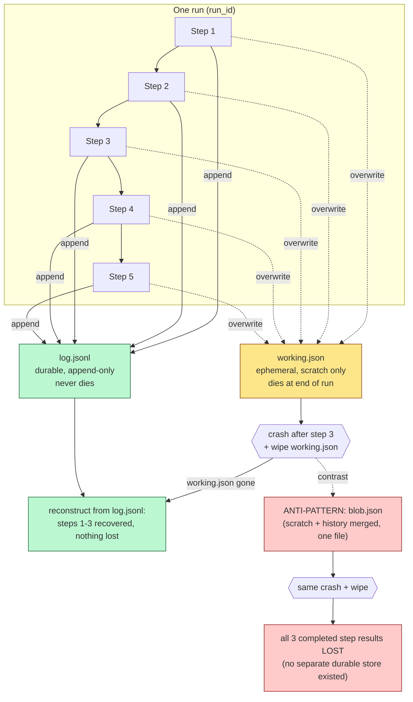

# Working State (Single Run)

"Working state" is what a single run needs to get from its first step to
its last: scratch values, in-progress buffers, whatever a step is computing
right now. It dies when the run ends — a crash, a container recycle, or a
delete of that file should destroy nothing that already mattered.

## Two tiers, never merged

Keep ephemeral scratch (overwritten every step) strictly separate from a
durable, append-only log (one line per completed step, never rewritten).
The separation costs one extra write per step, but it's what lets the
ephemeral tier be wiped outright after a crash and the run's true progress
reconstructed from the log alone, with zero loss.

## The single-blob anti-pattern is the realistic failure

Merging scratch and history into one overwritten file looks *better* than
the two-tier design while the run is healthy — the history is right there.
The failure is invisible until a crash is followed by a wipe of that file:
every completed step's result disappears along with the scratch, because no
separate durable store ever existed. Tier separation isn't a feature; it's
insurance against a failure with no symptoms until it's too late to matter.

## What this doesn't prove

This shows the data needed to resume survives a wipe of working state — not
that a process automatically resumes execution from the recovered point.
See `concepts/agent-infra/recovery.md`.

Evidence: `experiments/agent-infra/state/` (`RUN.md`, `NOTES.md`, `diagram.mmd` / `diagram.png`).
