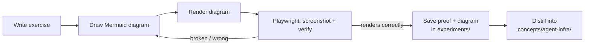
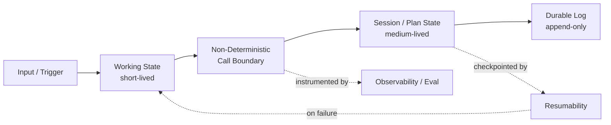
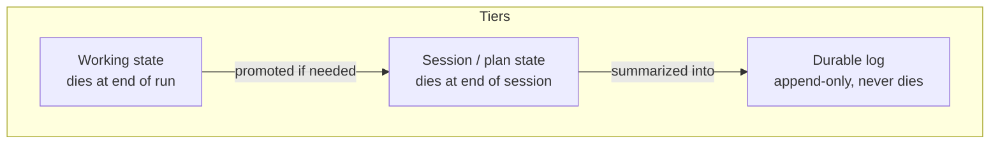
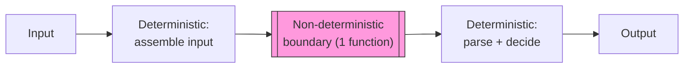
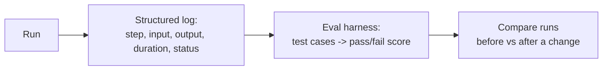
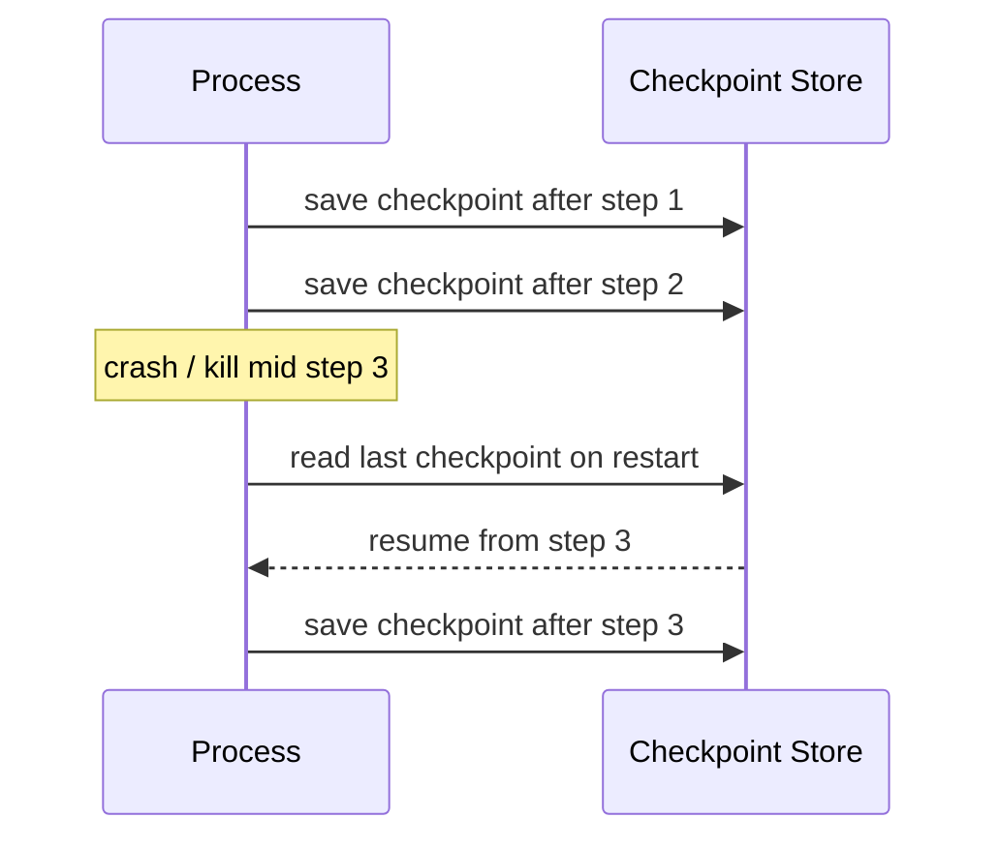

# PLAN.md — Infra Fundamentals Practice Plan

## 1. Goal

Build hands-on, working proof of each of the 4 infra patterns below. The test for "done" on each one is not "I understand the idea" — it's "I have a small working piece of code that would break in an obvious way if I removed the pattern."

## 2. Scope

Keep the exercises small and system-agnostic. Each one should be doable in a single script or small module — no need for a full application. The point is to internalize the pattern, not ship a product.

## 3. Working method for every topic

For each of the 4 topics below, the build loop is the same:

1. Write the practice exercise (small script / module). Save it, its logs, and any run evidence in the topic's `experiments/` folder (see target paths per topic below).
2. Draw a Mermaid diagram that illustrates the concept — this is how the knowledge gets encoded for later lookup, not just decoration.
3. Render the diagram and verify it with Playwright: open the rendered preview (Mermaid Live Editor, a local HTML file with mermaid.js, or Obsidian's export) in a headless browser, screenshot it, and confirm visually that it renders without syntax errors and matches what you intended. Save the diagram source + the verified screenshot in the same `experiments/` folder.
4. Only after 1–3 exist, distill a short framing paragraph into the topic's `concepts/agent-infra/` target file — matching the existing stub style (short, no code, no volatile figures). The concept file should read as the conclusion; the experiment folder is the evidence behind it.

## 4. Overview of the 4 topics

---

## 5. State & Memory Tiering

**Concept**: information has different lifetimes. Treating everything as one undifferentiated blob ("just store it in memory / a file") is the default mistake.

**Practice exercise**:
- Design a system with at least 3 explicit tiers, each with a stated lifetime (as above).
- Store each tier separately (e.g. `working.json`, `session.json`, `log.jsonl`) — never merge them into one file.
- Write a small script that proves the boundary: working state can be safely wiped without losing anything from the durable log.

**Target paths**:
- Proof / code / diagram screenshot → `experiments/agent-infra/state/` (the single-run "working state" part) and `experiments/agent-infra/memory/` (the session/durable-log part) — split across both, they are two different concept files.
- Distilled concept → `concepts/agent-infra/state.md` (working state, single-run) and `concepts/agent-infra/memory.md` (short-term vs long-term, cross-run).

---

## 6. Determinism at the Edge of a Non-Deterministic System

**Concept**: when one part of a system is inherently non-deterministic (e.g. an LLM call, a random sample, an external API with variable latency), everything *around* that part must be deterministic and reproducible, or debugging becomes guesswork.

**Practice exercise**:
- Isolate the non-deterministic call behind a single function boundary (one function, one clear input/output contract).
- Everything outside that boundary — how inputs are assembled, how outputs are parsed, how decisions are made — should be pure, testable code with no hidden randomness.
- Prove it: run the same input twice, log both the non-deterministic output and the deterministic decisions made around it. The deterministic parts should produce identical logs even when the non-deterministic output differs.

**Target paths**:
- Proof / code / diagram screenshot → `experiments/agent-infra/determinism/`.
- Distilled concept → `concepts/agent-infra/determinism.md` **(does not exist yet — create it)**. No existing stub in `agent-infra/` owns this; closest neighbors (`guardrails.md`, `recovery.md`) don't cover it either.

---

## 7. Observability / Eval-as-Infra

**Concept**: for a system with unpredictable or emergent behavior, reading the code is not enough to know what it actually does — you have to measure it. Observability isn't a nice-to-have added later; without it the system is unoperable.

**Practice exercise**:
- Add structured logging for every meaningful step: what ran, with what input, what output, how long it took, whether it succeeded.
- Build a minimal eval: define a small set of test cases with expected outcomes, run the system against them, and produce a pass/fail score — a number, not a feeling.
- Change one variable (a parameter, a prompt, a threshold) and re-run the eval. Confirm you can answer "did this change make it better or worse?" from the numbers alone.

**Target paths**:
- Proof / code / diagram screenshot → `experiments/agent-infra/observability/`.
- Distilled concept (tracing half) → `concepts/agent-infra/observability.md`.
- Eval-harness half → not a new concept file; feeds the existing `playbooks/build-eval-set.md`. General eval methodology already lives in root `concepts/eval.md` — don't duplicate it here.

---

## 8. Resumability & Checkpointing

**Concept**: failure should be treated as the default, not the exception. A system that has to restart from zero after any mid-way failure is broken by design, regardless of how well it performs on the happy path.

**Practice exercise**:
- Build a multi-step process (5+ steps) that writes a checkpoint after each step completes.
- Simulate a failure partway through (kill it, throw an exception, whatever is easiest).
- Restart the process and prove it resumes from the last completed checkpoint — it does not redo completed steps and does not lose track of what's left.

**Target paths**:
- Proof / code / diagram screenshot → `experiments/agent-infra/recovery/`.
- Distilled concept → `concepts/agent-infra/recovery.md` — extend its current retry/fallback/loop-guard framing to explicitly cover checkpoint-and-resume across a restart, not just in-run retries.

---

## 9. Wrap-up

After all 4 are done, write one page answering: which of these would silently break first in a system that ignored it, and why? That's the practical argument for why this layer matters more than picking the right model.

**Done** — answered in `concepts/agent-infra/README.md`; summarised in §10 below.

---

## 10. Status — completed 2026-09-07

All 4 topics built, proven, and distilled. Nothing in `concepts/` was written
before its experiment existed and its diagram was independently verified.

| Topic | Evidence | Concept file | Diagram |
|---|---|---|---|
| State (single-run working state) | `experiments/agent-infra/state/` | `concepts/agent-infra/state.md` | verified |
| Memory (cross-run tiering) | `experiments/agent-infra/memory/` | `concepts/agent-infra/memory.md` | verified |
| Determinism at the boundary | `experiments/agent-infra/determinism/` | `concepts/agent-infra/determinism.md` (new) | verified |
| Observability + eval-as-infra | `experiments/agent-infra/observability/` | `concepts/agent-infra/observability.md` + `playbooks/build-eval-set.md` steps 7–9 | verified |
| Resumability / checkpointing | `experiments/agent-infra/recovery/` | `concepts/agent-infra/recovery.md` | verified |

Each experiment folder holds runnable code (Python 3.9, stdlib only), a `RUN.md`
of real captured stdout, a `NOTES.md` of findings and explicit limits, plus
`diagram.mmd` and a verified `diagram.png`.

### What each run actually showed

- **State** — crash + wipe of the ephemeral tier loses zero committed progress;
  the single-blob alternative loses all completed history at that same moment.
- **Memory** — session expiry is safe only because of promote-then-delete
  *ordering*; both tiers use the same storage mechanism and differ only in policy.
- **Determinism** — a parser keyed on incidental phrasing flipped a real
  access-control decision (grant vs deny) on identical input, with no crash and
  healthy-looking logs. Record/replay then made the whole pipeline byte-identical.
- **Observability** — a naive print-log and a structured JSONL log scored an
  identical 12/18; only the structured one could tell a crash from a wrong answer.
  The threshold change was a real trade (+11.1pp net, 8/18 cases flipped).
- **Recovery** — a real `SIGKILL` mid-step, then a new process resumed to a
  final artifact md5-identical to an uninterrupted run — but only because
  checkpoints were paired with atomic commits (temp file + rename).

### Deviations from the plan as written

1. `concepts/agent-infra/` did not exist on `main` while this work was built —
   the scaffold landed separately (PR #3) and was merged in afterwards. The
   four deep dives replace the stubs they were meant to extend; `recovery.md`
   keeps the retry/fallback/loop-guard framing as an explicitly unproven
   adjacent note, since only checkpoint-and-resume was demonstrated.
2. `guardrails.md` was deliberately **not** deep-dived — no experiment backs
   it. It stays at the scaffold's opening framing, alongside
   `context-engineering.md`, `tool-calling.md`, and `orchestration.md`.
3. Step 3's rendering was done with a local harness
   (`experiments/agent-infra/_diagram-harness/`: vendored mermaid + `render.mjs`)
   rather than Mermaid Live Editor. It scans the output SVG for mermaid's own
   error signatures, since mermaid renders a syntax error as a graphic instead
   of throwing — a screenshot alone is not proof. Committed known-good and
   known-broken fixtures show the harness can actually fail.
4. Environment constraint: the Playwright MCP browser blocks `file:` URLs, so
   diagrams are served over a local `http.server` before screenshotting.
   Documented in the harness README.

### §9 answer

Written up in `concepts/agent-infra/README.md`. In short: determinism leaks
break first and most silently, because they need no failure event at all —
the access-control flip happened on a normal run. Tiering loss and non-atomic
corruption come next, silent but gated behind a crash actually occurring.
Missing checkpoints are last, since redone steps are visible in the log
immediately. Observability is the pattern that decides whether any of the other
four is ever *noticed* rather than absorbed into a reasonable-looking score.

### Known not-proven (carried in each NOTES.md, kept out of the concepts)

Concurrent/parallel access (all topics); real LLM sampling variance (the
determinism proof stayed offline by design, `--live` is wired but unexercised);
session continuity across expiry; non-idempotent side effects such as payments,
which need dedup keys rather than idempotent recompute; and a crash landing
during the checkpoint file's own atomic write.
